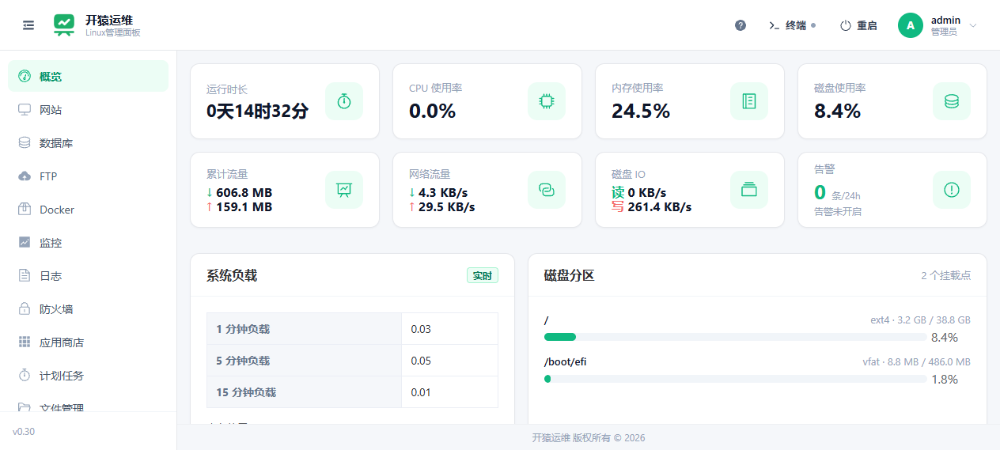
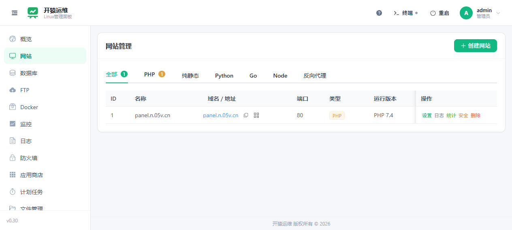
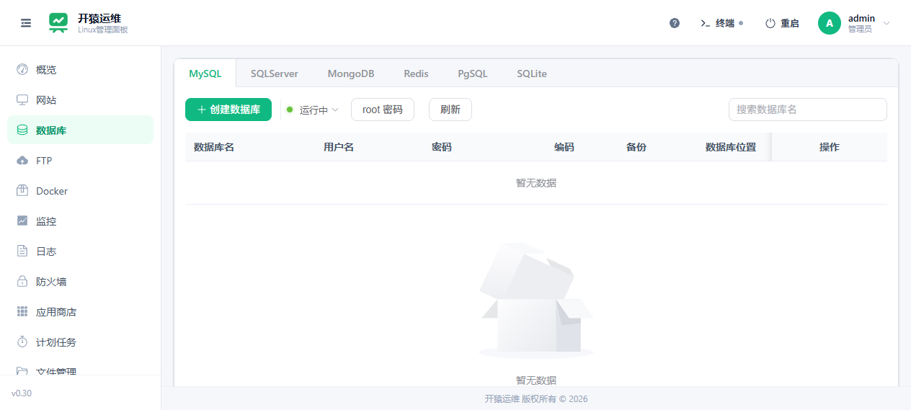
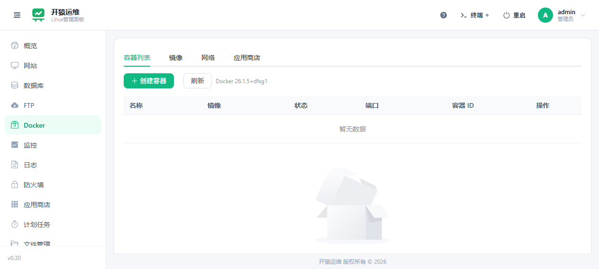
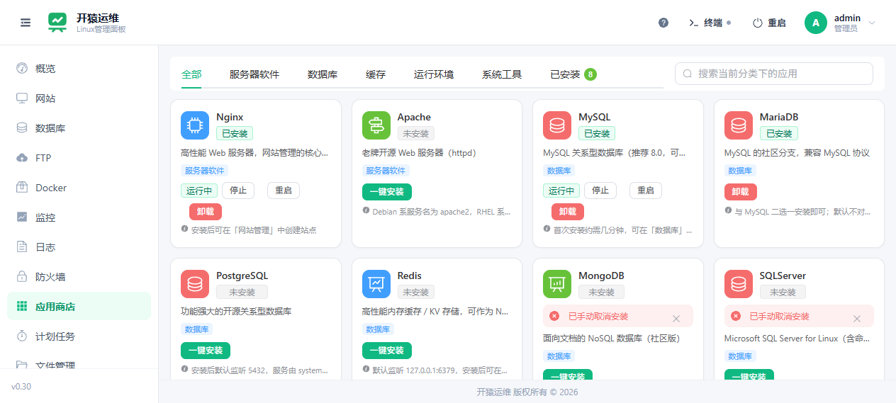

# kypanel（开猿运维）

Linux 服务器管理面板。

- **后端**：Go (Gin) — 单二进制，SQLite 存储
- **前端**：Vue 3 + Vite，构建产物输出到 `webui/dist`（支持 `go:embed` 内嵌或前后端分离部署）
- **目标系统**：Linux（Ubuntu / Debian / CentOS / Rocky，x86_64 + ARM64）
- **AI 原生**：内置 [MCP Server](docs/mcp.md)，支持 Claude Code / Codex / Cursor 等 AI 工具远程运维

## 功能截图

| 概览 | 网站 |
|---|---|
|  |  |

| 数据库 | Docker |
|---|---|
|  |  |

| 应用商店 |
|---|
|  |

## 主要功能

- **网站**：静态 / PHP / Node / Python / Go / 反向代理，SSL 证书（Let's Encrypt、DNS 验证）、日志分析、访问统计
- **数据库**：MySQL / SQLServer / MongoDB / Redis 管理，备份恢复、phpMyAdmin
- **Docker**：容器 / 镜像 / 网络管理，Docker 应用商店
- **FTP**：账号管理与启停
- **运行环境**：PHP 版本与扩展、php.ini / FPM 配置、Node / Python / Go 环境
- **安全**：防火墙规则、WAF（全局 + 单站点）、CC 防护、封禁 IP、网站安全
- **运维**：监控、计划任务、备份中心、进程管理、文件管理（断点续传、回收站）、WebSocket 终端
- **多用户**：子账号、角色权限、操作日志、双因素认证（2FA）
- **AI 运维**：MCP 接口接入 Claude Code / Codex / Cursor

## 文档

- [API 接口文档](docs/api.md) — 全部 REST API 路由、鉴权方式与示例
- [MCP 接口文档](docs/mcp.md) — AI 工具接入 MCP 的方法与工具说明

## 构建

### 1. 构建前端

```bash
cd web
npm install
npm run build   # 产物输出到 webui/dist
```

### 2. 构建后端（交叉编译）

Linux：

```bash
./scripts/build.sh amd64   # 或 arm64
```

Windows（PowerShell）：

```powershell
powershell -File scripts/cross-build.ps1
```

构建产物统一输出到 `bin/`：

| 产物 | 说明 |
|---|---|
| `bin/kypanel_amd64` | 后端二进制（交叉编译，内嵌前端） |
| `bin/panel-web.tar.gz` | 前端独立包（可单独替换部署） |
| `bin/ip2region.xdb` | IP 归属离线库（约 11MB，独立部署） |
| `bin/i.sh` | 服务器安装脚本 |

## 部署

前后端分离部署：上传后端二进制 + 前端包到服务器，前端解压到数据目录的 `web/` 文件夹。

- 后端启动时磁盘前端优先（存在 `index.html` 时优先托管磁盘前端）
- 前端可单独替换、刷新即生效，无需重新编译后端

## 目录结构

```
kypanel/
├── cmd/panel/           # 后端入口
├── internal/            # Go 后端（config/logger/model/service/router/middleware/utils）
├── web/                 # Vue 3 前端源码
├── webui/               # 前端构建产物（go:embed 目标目录）
├── docs/                # 文档（API / MCP / 截图）
├── scripts/             # 构建/安装/运维脚本
└── data/                # 运行时数据（SQLite、日志、IP 库，不提交）
```

## 许可

Apache-2.0
